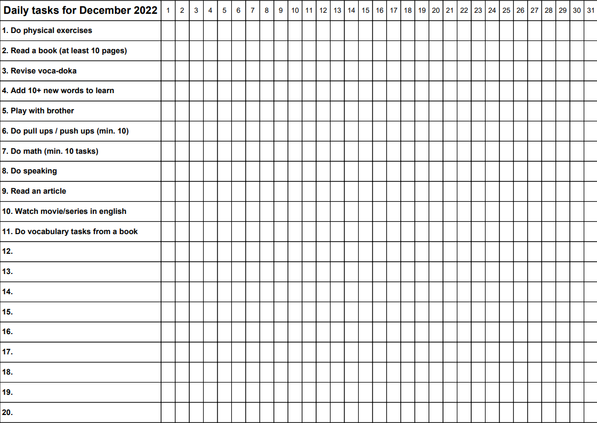

# Ta Da List - the most effective to do list ever

## How to edit tasks?
Unfortunately, you will need to change tasks in code to desired ones by yourself for a while.

## How to use it?
The main thing of Ta Da List is that you type your daily tasks, print them and follow every day.
Having done a task you just tick a proper cell by your hand and track your habits.

## What to do with the blank tasks?
Don't worry if you couldn't fill all spaces because you can write it with a pen or a pencil at any time once you have printed it 