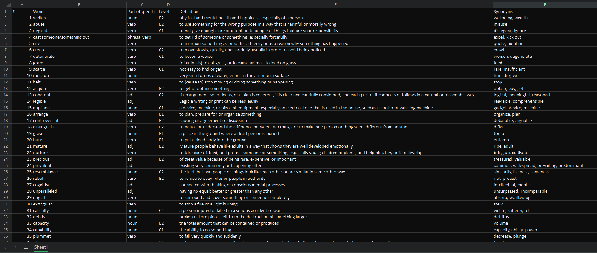
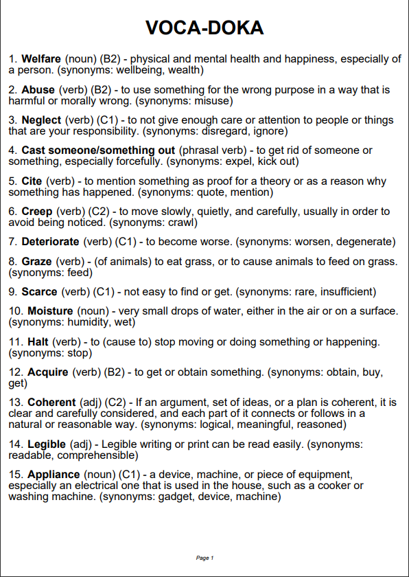

# The new technique of learning new words of any language

## The first step
First of all you need to fill accurately data in Excel sheet in order to transfer that to the PDF file from which it can be printed easily.



- The first column shows the numeration of words that may be useful to track the amount of words you have learned
- In the second column there is the main word you learn
- The third and fourth column show the part of speech and the level of word if there is respectively
- The biggest fifth column account for the meaning of the word
- The last column is responsible for synonyms of the main word

## The second step
Having filled data, save the Excel file naming it ```voca.xlsx```. Then paste that file in folder with code

## The last step
The final step is to run the python file ```main.py```, after which a PDF file will occur in the folder

